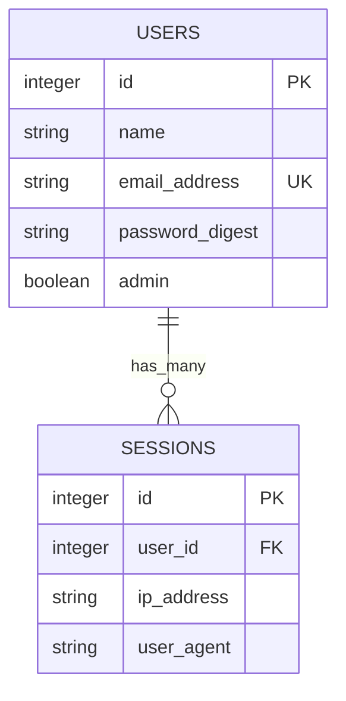
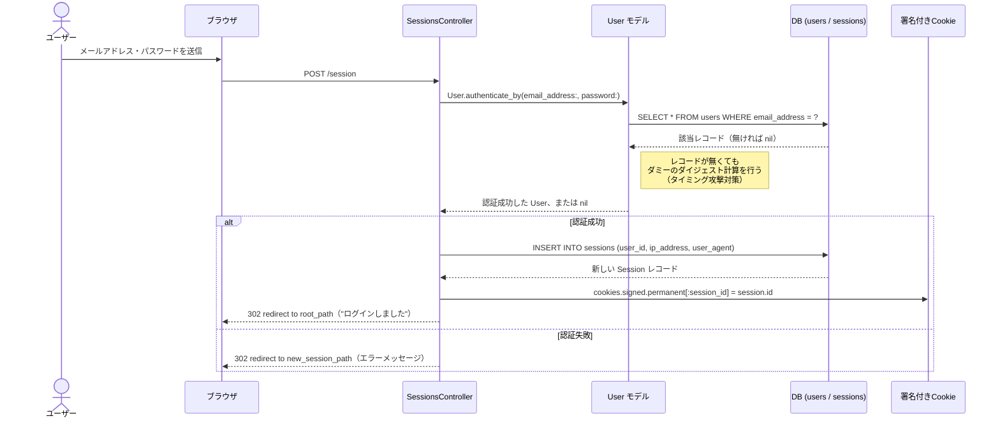
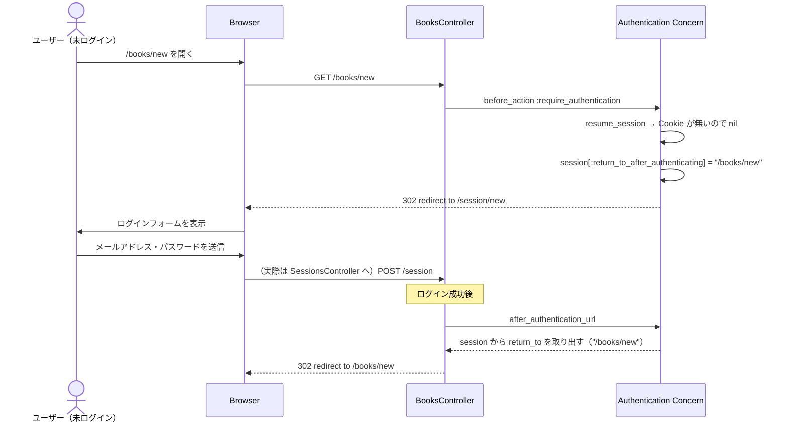
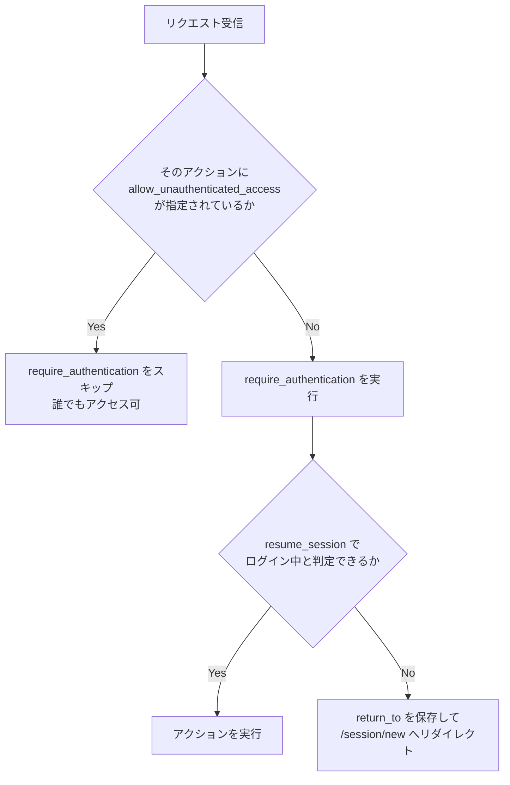
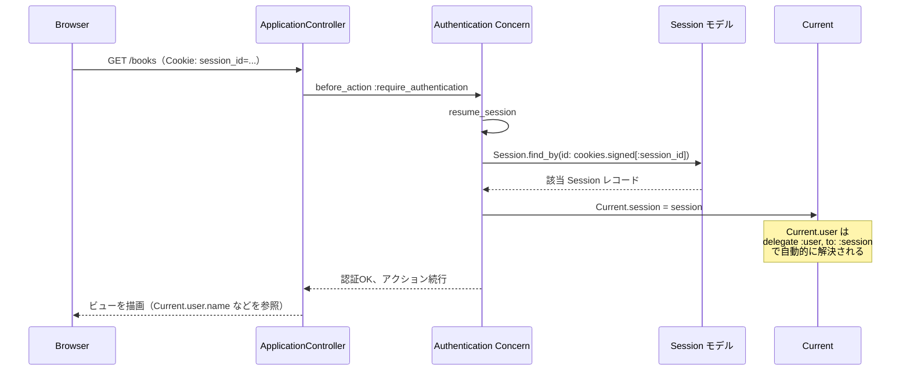
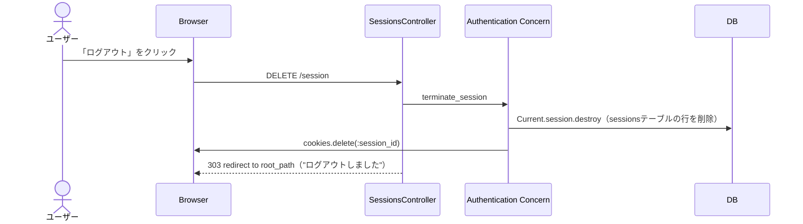

# 解説：Rails 8 標準認証機構（`bin/rails generate authentication`）

> このドキュメントは、本プロジェクトに導入した認証の仕組みを図解するもの。
> 「なぜこの設計か」の判断記録は `docs/design-decisions-authors.md` と同様の ADR 的な視点も交えつつ、
> ここでは**リクエストがどう流れるか**を Mermaid 図で追えることを主眼に置く。

- 対象: `app/controllers/concerns/authentication.rb` を中心とした認証の仕組み全体
- 導入日: 2026-07-01
- 経緯: 自前実装（`session[:user_id]` を直接読み書きする方式）でレビューを行ったところ、「保護し忘れ」「セッション固定攻撃への対策漏れ」が見つかった。Rails 8.0 で新設された `bin/rails generate authentication` の標準実装に全面移行することで、これらを構造的に防ぐ設計に切り替えた

---

## 全体構成

関わるファイルと役割：

| ファイル | 役割 |
|---|---|
| `app/controllers/concerns/authentication.rb` | 認証の中核ロジック（Concern） |
| `app/controllers/application_controller.rb` | `include Authentication` して全コントローラーに適用 |
| `app/controllers/sessions_controller.rb` | ログイン／ログアウトの入口 |
| `app/controllers/users_controller.rb` | サインアップ（登録と同時に自動ログイン） |
| `app/models/user.rb` | `has_secure_password` でパスワードを扱う本体 |
| `app/models/session.rb` | ログイン1回＝1レコードの、DBに残るセッション |
| `app/models/current.rb` | `ActiveSupport::CurrentAttributes`。リクエスト中どこからでも `Current.user` を参照できる |

### データモデル（ER図）

以前の実装は「Railsの標準セッション（暗号化Cookie1個）の中に `user_id` を直接書き込む」方式だった。今回は「ログインする度に `sessions` テーブルへ1行INSERTし、その行のIDだけを署名付きCookieに載せる」方式に変えている。この違いが以下の図解の随所に効いてくる。

---

## ① ログインのシーケンス

**ポイント**: `User.authenticate_by` は該当レコードが見つからない場合でも `new(passwords)` を経由してダミーのダイジェスト計算を実行する（`activerecord-8.1.3/lib/active_record/secure_password.rb` で確認済み）。これにより「メールアドレスが存在するかどうか」を応答時間の差から推測されにくくしている。以前の `User.find_by(email: ...) → &.authenticate` はレコードが無ければ即座に `nil` を返していたため、この対策が無かった。

---

## ② 未ログイン状態で保護ページにアクセスした場合

`Authentication` Concern は `before_action :require_authentication` を**全アクションにデフォルトで適用**し、公開したいアクションだけ `allow_unauthenticated_access` で個別に除外する。`BooksController` では `index` / `show` のみ除外しているため、`new` は自動的にログイン必須になる。

**保護のかかり方（ホワイトリスト運用への転換）**

**なぜこれが重要か**: 以前の自前実装は `require_login` という「保護するためのメソッド」を用意したが、`BooksController` に `before_action :require_login` を書き忘れ、実質誰でも本の登録・削除ができる状態になっていた（コードレビューで発覚）。今回の実装は逆に「デフォルトで保護し、公開したいものだけ明示的に許可する」設計のため、**書き忘れた場合の失敗モードが「脆弱」ではなく「ログインを要求してしまう（不便）」に変わる**。安全な方向にしか倒れない。

---

## ③ 認証済みリクエストで `Current.user` が解決される流れ

ログイン後の通常のリクエストは、毎回このやり取りを経て `Current.user` にアクセス可能になる。

`app/models/current.rb` は `ActiveSupport::CurrentAttributes` を継承しており、リクエスト単位（スレッドローカルに近い仕組み）で値を保持する。これにより、コントローラーの外側（モデルやジョブなど）からも `Current.user` として同じユーザー情報を参照できる。以前の `current_user` はコントローラーの helper メソッドだったため、コントローラーの外からは使えなかった。

---

## ④ ログアウトのシーケンス

**セッション固定攻撃対策との関係**: 以前の実装はログイン成功時に `reset_session` を明示的に呼ぶことでセッション固定攻撃（攻撃者が事前に発行させたセッションIDを被害者に使わせ、ログイン後に乗っ取る攻撃）を防いでいた。今回の実装は `reset_session` を一切呼んでいないが、ログインの度に `sessions` テーブルへ**新しい行**を作り、その行IDを新しいCookie値として発行するため、構造的に同じ効果を得ている。攻撃者が事前に把握できたCookie値は、被害者がログインしても別の（無関係な）Sessionレコードのままであり、被害者の新しいログインに紐づくCookie値を知る術がない。

---

## 参照した情報源

- Action Controller Overview（フィルタの仕組み）: https://guides.rubyonrails.org/action_controller_overview.html#filters
  なぜこの章か: `before_action` がコントローラー単位の宣言でしか効かないこと、`allow_unauthenticated_access`（`skip_before_action`）で個別に除外する仕組みの土台になっているため
- Ruby on Rails Security Guide（セッション・セッション固定攻撃）: https://guides.rubyonrails.org/security.html#sessions
  なぜこの章か: 今回のDBバックドセッション方式が、ガイドが推奨する「ログイン成功時に新しいセッション識別子を発行する」という原則をどう満たしているかの比較基準になるため
- `has_secure_password` / `authenticate_by` の API ドキュメント: https://api.rubyonrails.org/classes/ActiveModel/SecurePassword/ClassMethods.html
  なぜこの章か: タイミング攻撃対策のためのダミーダイジェスト計算や、bcryptの72バイト上限バリデーションなど、今回のUserモデルが依拠している自動バリデーションの根拠のため
- `normalizes`（Active Record の属性正規化）: https://api.rubyonrails.org/classes/ActiveRecord/Normalization/ClassMethods.html
  なぜこの章か: `find_by`/`authenticate_by` によるクエリ時にも正規化が自動適用される仕組みを理解するため
- `ActiveSupport::CurrentAttributes`: https://api.rubyonrails.org/classes/ActiveSupport/CurrentAttributes.html
  なぜこの章か: `Current.user` がリクエスト単位でどう保持され、コントローラー外からも参照できるのかを理解するため

**検索キーワードの提案**
- `Rails 8 authentication generator`
- `Rails allow_unauthenticated_access`
- `Rails authenticate_by timing attack`
- `ActiveSupport::CurrentAttributes rails`
