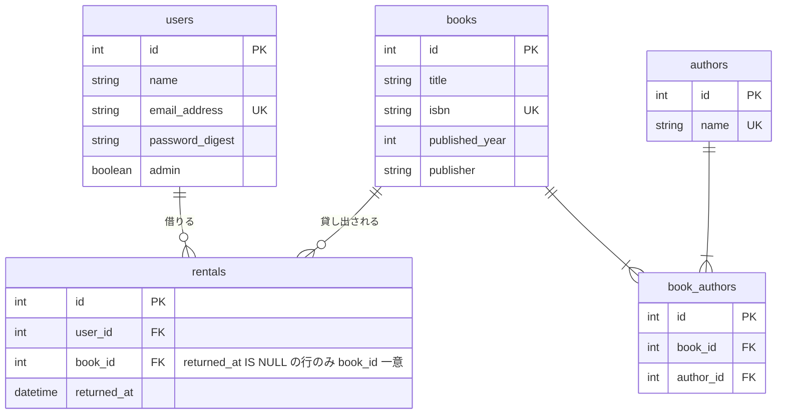
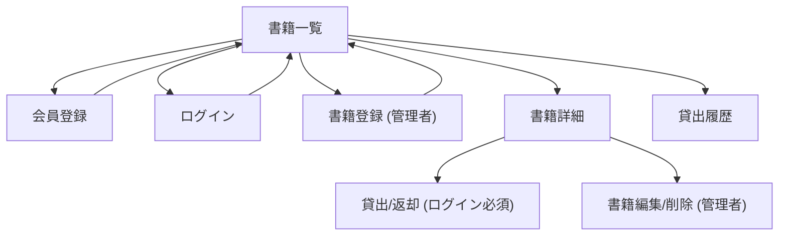

# CRUDマトリクス・画面URL一覧

発展要件（権限分離・貸出履歴閲覧）まで含めた完成形を前提に整理する。

## 1. ER図

## 2. CRUDマトリクス

| ユーザーの役割 | 書籍データ（著者含む） | 貸出データ | 会員データ |
|---|---|---|---|
| ゲスト（未ログイン） | R | — | C（新規登録） |
| 一般ユーザー | R | C, R, U（自分の分だけ） | R, U（自分の分だけ） |
| 管理者 | C, R, U, D | C, R, U（自分の分だけ）, R（すべて） | R（すべて） |

## 3. 画面URL一覧

| 画面 | メソッド/パス | Controller#Action | 権限 |
|---|---|---|---|
| 書籍一覧 | GET /books | books#index | 誰でも |
| 書籍詳細 | GET /books/:id | books#show | 誰でも |
| 書籍登録 | GET /books/new, POST /books | books#new, books#create | 管理者 |
| 書籍編集 | GET /books/:id/edit, PATCH /books/:id | books#edit, books#update | 管理者 |
| 書籍削除 | DELETE /books/:id | books#destroy | 管理者 |
| 貸出 | POST /books/:book_id/rentals | rentals#create | ログイン必須 |
| 返却 | PATCH /rentals/:id | rentals#update | ログイン必須（本人のみ） |
| 貸出履歴 | GET /rentals | rentals#index | ログイン必須（一般=自分のみ／管理者=全件） |
| 会員登録 | GET /signup, POST /users | users#new, users#create | 未ログイン |
| ログイン | GET /session/new, POST /session | sessions#new, sessions#create | 未ログイン |
| ログアウト | DELETE /session | sessions#destroy | ログイン中 |
| パスワード再設定 | GET/POST /passwords, GET/PATCH /passwords/:token | passwords#* | 未ログイン |

## 4. 画面遷移図

