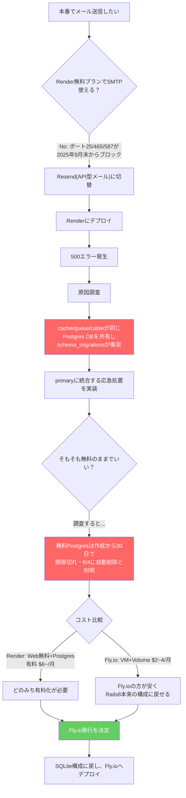
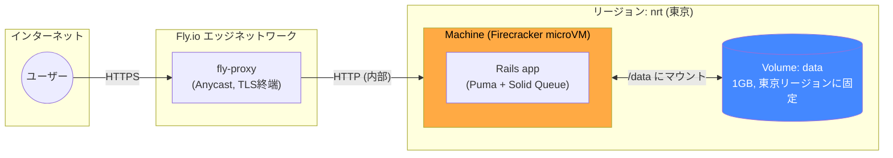
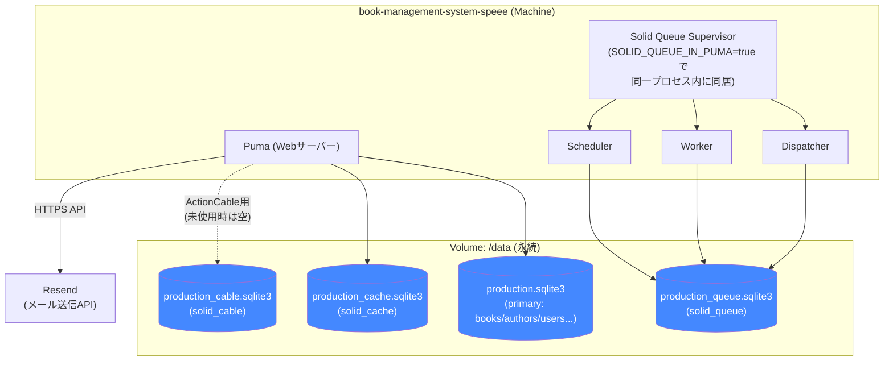
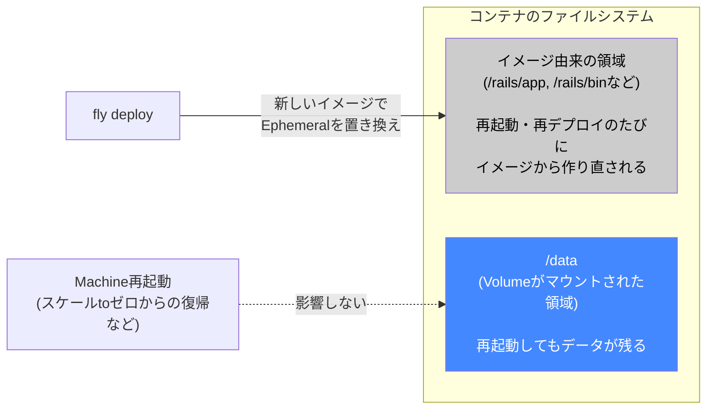
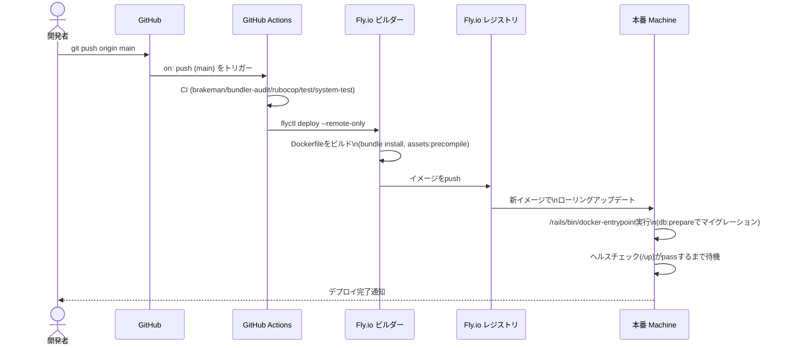
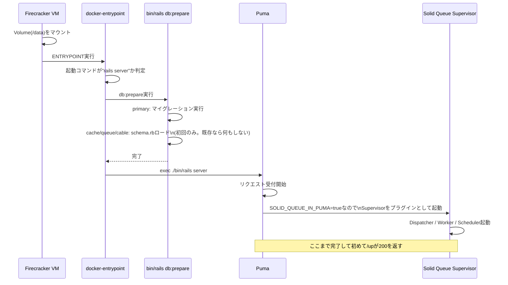
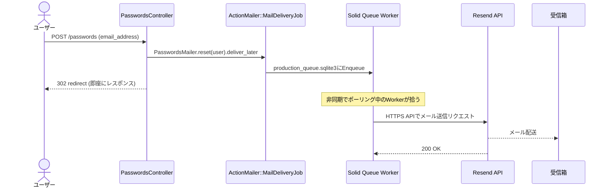
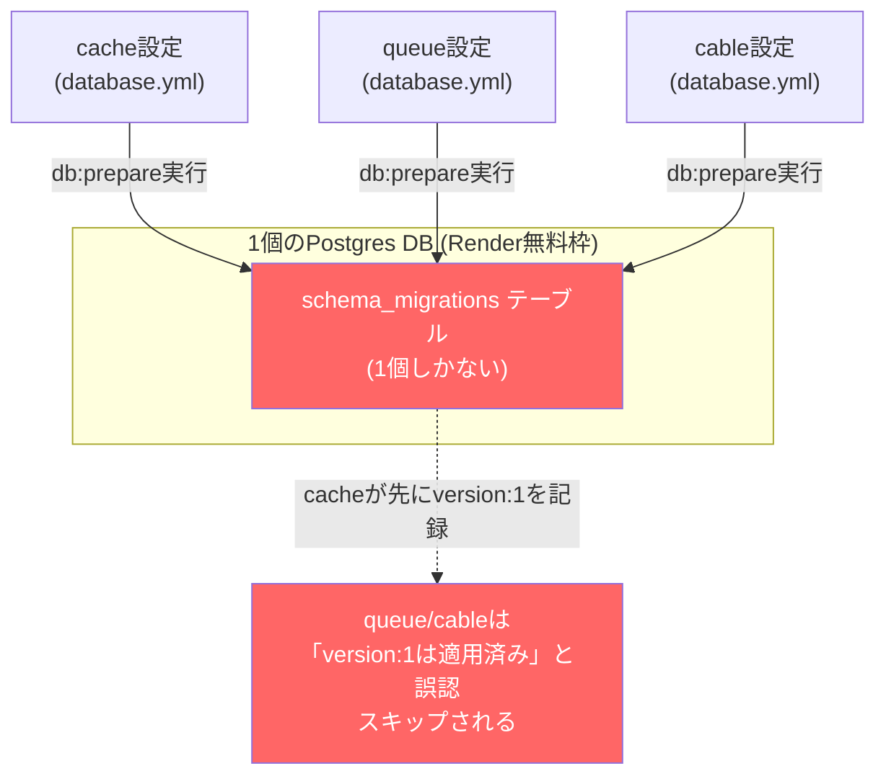

# 解説：デプロイ基盤をRender(Postgres)からFly.io(SQLite)に移行した話

> 本番でメーラー(Resend)を使いたい、という一言から始まり、最終的にデプロイ先そのものを
> 変更する結果になった一連の作業の記録。「何を」変更したかだけでなく、「Fly.ioが何者で、
> なぜこの構成にしたか」を Mermaid 図で追えることを主眼に置く。

- 対象: 本番デプロイ基盤全体（Render → Fly.io）、`config/database.yml`、`fly.toml`、`Dockerfile`、GitHub Actions
- 作業日: 2026-07-02
- 経緯: パスワードリセット機能で本番メール送信をしたかったが、Renderの無料プランはSMTP送信をブロックしている。API型メール(Resend)に切り替えて解決したが、その過程でRenderの無料Postgres特有の設計上の問題（後述）と、無料Postgresの30日期限切れという制約に突き当たり、「無料枠のパッチを重ねるコスト」が「デプロイ先を変えるコスト」を上回ると判断してFly.ioに移行した

---

## 1. なぜRenderからFly.ioに移行したか

判断の流れを図にすると以下の通り。

途中で実装した「Postgres統合の応急処置」は、コミットする前に破棄した。無駄に見えるかもしれないが、実際に手を動かして複雑さを体感したからこそ「アーキテクチャごと変える」判断に自信を持てた、という経緯がある。

---

## 2. Fly.ioというプラットフォームの仕組み

Fly.ioは「Dockerイメージを、世界中のデータセンターにある軽量VM（Machine）で動かす」PaaS。Renderのような典型的なPaaSとの一番の違いは、**各Machineに永続ディスク（Volume）を直接アタッチできる**という点。

**RenderのFree Web Serviceとの決定的な違い**：RenderのFreeプランはコンテナのローカルファイルシステムが完全にエフェメラル（永続ディスクは有料プラン限定）。Fly.ioは無料枠こそ廃止されているが、VM本体（Machine）とは独立した**ブロックストレージ(Volume)**を、無料プランの制約を気にせず安価に使える。これが「SQLiteをそのまま本番で使う」という選択を現実的にしている理由。

---

## 3. 本アプリのFly.io上での構成

ポイントは、`primary` / `cache` / `queue` / `cable` が**それぞれ別々の物理SQLiteファイル**になっていること。Renderで使っていたPostgresは1個のDBインスタンスしか無料で持てなかったため、この4つを同じDBに無理やり同居させ、それぞれの`schema_migrations`管理テーブルが衝突するというバグを踏んだ（詳細は8章）。Fly.ioでは1つのVolumeの中に**ファイルとして**4つ分離して置けるので、この問題がそもそも起こらない。

---

## 4. SQLite + 永続Volumeの仕組み

コンテナ内のファイルシステムは「イメージレイヤー」＋「Volume」の2階建てになっている。

Renderの無料プランで踏んだ問題は、まさにこの「Ephemeralな領域にSQLiteファイルを置いていた」に相当する状態だった（正確にはRender FreeにVolumeという概念自体が無い）。Fly.ioでは`fly.toml`の`[[mounts]]`でVolumeを明示的に`/data`にマウントし、`DATABASE_URL=sqlite3:///data/production.sqlite3`という環境変数でRailsにその場所を教えている。

---

## 5. デプロイの仕組み（push → 本番反映まで）

今回、GitHub Actionsによる自動デプロイを組んだので、`git push`するだけで以下が自動的に走る。

`FLY_API_TOKEN`がGitHub Secretsに（`fly launch`実行時に自動で）登録されているので、GitHub Actions上の`flyctl`がこのトークンでFly.ioにログインしてデプロイできる、という仕組み。

---

## 6. Machine起動時のシーケンス

Machineが起動する（スケールtoゼロからの復帰、または再デプロイ）たびに、以下の順で処理が走る。

`SOLID_QUEUE_IN_PUMA`の設定を最初忘れていて、「メールはEnqueueされるが送信されない（Performedのログが出ない）」という状態に一度なった。単一Machine構成では、Webサーバーとジョブワーカーを分けずに同じプロセス内に同居させるのがFly.io/Kamalでの定石。

---

## 7. メール送信の全体フロー(今回の本来の目的)

`deliver_later`（同期的にSMTP接続するのではなく、いったんキューに積んで後で送る）にしているおかげで、ユーザーへのレスポンスがメール送信の成否を待たない設計になっている。これはRenderでもFly.ioでも変わらない、Rails側の設計の恩恵。

---

## 8. （参考）Renderで踏んだPostgres統合バグの構造

反面教師として構造を残しておく。

`solid_cache`/`solid_queue`/`solid_cable`のスキーマスナップショットが、それぞれ独立に`version: 1`から採番されているのが元凶。物理的に同じDBを共有した瞬間に、この採番が衝突する。Fly.io + SQLiteでは各々が別ファイルなので、この採番の衝突自体が起こり得ない。

---

## 9. 変更したファイル一覧

| ファイル | 変更内容 |
|---|---|
| `config/database.yml` | production を Postgres(単一DB共有) → SQLite(4ファイル分離、Rails 8デフォルト) に戻す |
| `config/environments/production.rb` | `solid_queue.connects_to`を復元、Resendのdelivery_method設定はそのまま維持 |
| `Gemfile` / `Gemfile.lock` | `pg`を削除、`sqlite3`を全環境で利用可能に、`dockerfile-rails`を追加(fly launchが自動追加) |
| `Dockerfile` | ビルドステージに`libffi-dev`を追加(fly launchが検出した不足パッケージ) |
| `fly.toml` | 新規。Volumeマウント(`/data`)、ヘルスチェック、`SOLID_QUEUE_IN_PUMA=true`などを定義 |
| `config/dockerfile.yml` | 新規。`dockerfile-rails`gemの設定ファイル |
| `.github/workflows/fly-deploy.yml` | 新規。mainへのpushで`flyctl deploy`を自動実行 |
| `db/seeds.rb` | `must_have_author`バリデーションの順序バグを修正(著者未紐付けで`save!`していた) |
| `test/application_system_test_case.rb` / `test/system/books_test.rb` | 新規。CIの`system-test` Jobが空ディレクトリでLoadErrorになっていたのを解消 |

---

## 10. 実施した手順（作業ログ）

1. Resend公式gem(`resend`)を追加し、`config/initializers/resend.rb`でAPIキーを読み込む設定
2. `config.action_mailer.delivery_method = :resend`に変更、送信元を`onboarding@resend.dev`(検証不要のサンドボックス)に
3. Renderで500エラー発生 → 原因調査 → `db:migrate`ではなく`db:prepare`が必要と判明
4. 再度500エラー(`solid_queue_jobs`が無い) → cache/queue/cableのPostgres共有問題を発見
5. 一時対応としてqueue/cableをprimaryに統合する修正を作成(後に破棄)
6. Render無料Postgresの30日期限切れ・料金比較からFly.io移行を決定
7. `config/database.yml`等をSQLite(Rails 8デフォルト)構成に復元
8. `fly auth login` → `flyctl launch --no-deploy`でfly.toml等を生成
9. `Dockerfile`に`libffi-dev`を追加
10. `fly secrets set`で`APP_HOST`・`RESEND_API_KEY`を設定
11. `fly deploy`で初回デプロイ → `db/seeds.rb`のバグを発見・修正 → 再デプロイ
12. `SOLID_QUEUE_IN_PUMA`未設定でメールが送信されない問題を発見・修正 → 再デプロイ
13. 実際に自分のメールアドレス宛でパスワードリセットメールが届くことを確認
14. コミット・push → GitHub Actions経由の自動デプロイを確認
15. ついでに見つかったCIの既存不具合(crassのCVE、system-test未整備)を修正

---

## 11. Render vs Fly.io 比較

| 項目 | Render (Web無料 + Postgres) | Fly.io (Machine + Volume) |
|---|---|---|
| 月額目安 | 約$6〜（Postgresが有料化必須） | 約$2〜4 |
| DBの実体 | マネージドPostgres(別サービス) | SQLiteファイル(アプリと同じVolume内) |
| 無料Postgresの制約 | 30日で期限切れ、1GB上限 | 該当なし(Volumeは自分で持つ) |
| Rails 8デフォルト構成との親和性 | 低い(Postgres前提に手動で作り変えが必要) | 高い(Kamal向けデフォルトがほぼそのまま使える) |
| SMTP送信 | 無料プランでブロック(2025年9月〜) | 制限なし(ただし今回はAPI型のResendを継続利用) |
| スケールtoゼロ | あり(15分無操作で停止、コールドスタートあり) | あり(`auto_stop_machines`で同様の挙動) |

---

## 12. なぜRails 8のデフォルト構成にFly.ioが合うか

Rails 8は「`rails new`した直後から、Kamalで自前のVPSにDockerでデプロイする」ことを前提に設計されている。具体的には：

- SQLiteを`storage/`配下に置き、`config/deploy.yml`で`volumes:`として永続化する前提
- `solid_queue` / `solid_cache` / `solid_cable`は、それぞれ独立したSQLiteファイルとして動くのがデフォルト
- Dockerfile自体もRails標準ジェネレータが生成したものがそのまま使える

Fly.ioは「Dockerイメージ＋Volume」というKamalとほぼ同じメンタルモデルを、マネージドなインフラ（VM調達・ネットワーク・TLS終端）の上で提供してくれる。つまり「Kamalで自分のVPSを借りて運用する」ことの代わりに「Fly.ioに運用を任せる」形になっており、**Rails 8のデフォルトが想定するアーキテクチャを、インフラの面倒を見ずに再現できる**のがFly.ioを選んだ本質的な理由。RenderのPostgres前提の構成は、この設計思想から外れた場所に人力でパッチを当て続ける状態だった。

---

## 13. 今後の注意点・トレードオフ

- **コールドスタート**: `min_machines_running = 0`のため、15分程度アクセスが無いとMachineが止まり、次のリクエストで起動待ち（数秒〜十数秒）が発生する。Renderの無料枠と同様の体験。
- **単一リージョン制約**: SQLiteのVolumeは1つのMachineに紐づくため、複数リージョンに分散させることは基本的にできない（学習用途では問題にならない）。
- **バックアップ**: Volumeのスナップショット機能はあるが、Postgresのような自動バックアップは無いので、必要になったら`fly volumes snapshots`まわりを別途調べる必要がある。
- **Resendのサンドボックス制約**: 独自ドメインを検証するまでは、`onboarding@resend.dev`からは自分のResendアカウント登録メール宛にしか送れない。全ユーザーへの本番配信を試したくなったらドメイン検証が必要になる。
