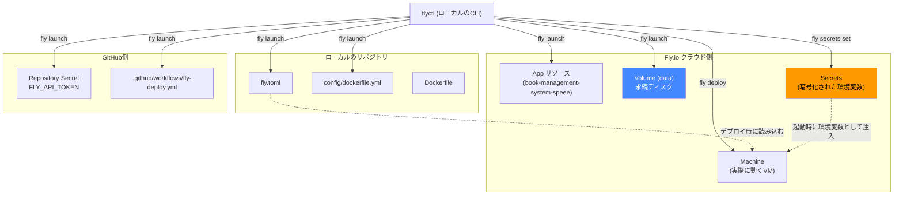
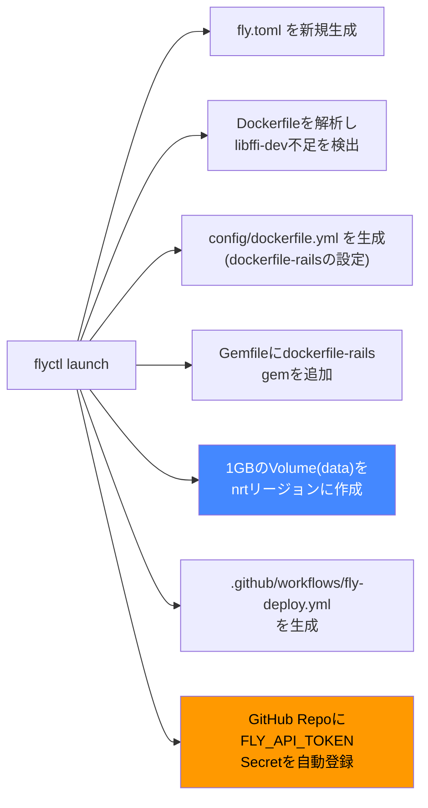
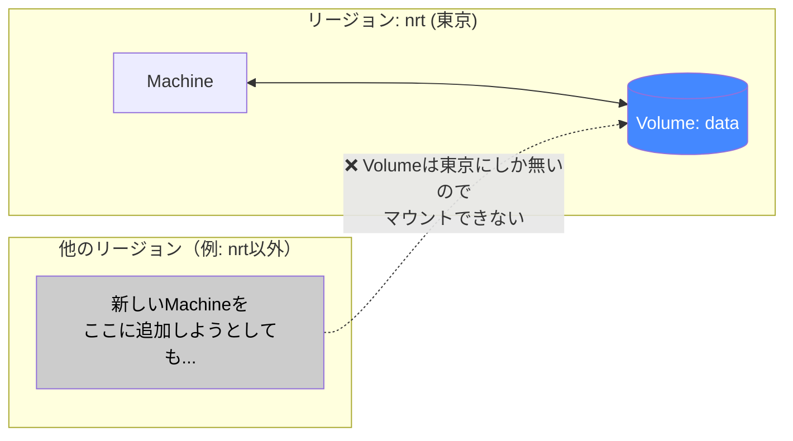
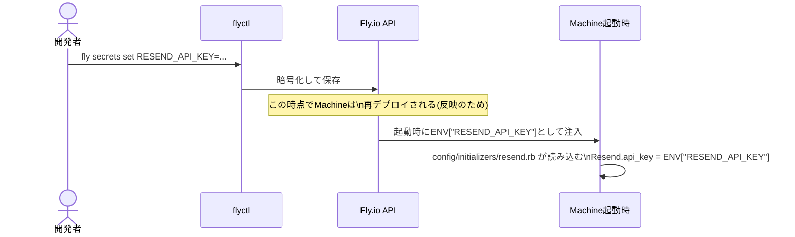
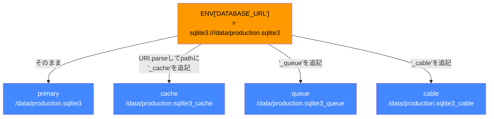

# 解説：Fly.io CLI (`flyctl`) で設定した項目と、それぞれが必要な理由

> `docs/deployment-fly-io.md` が「なぜRenderからFly.ioに移行したか」という物語だとすると、
> このドキュメントは「Fly.ioにデプロイするために、CLIで具体的に何を設定し、それぞれの設定が
> 無いと何が起きるのか」だけを掘り下げるリファレンス。Fly.ioの仕組みそのものを理解しながら、
> 自分で別アプリをデプロイするときに迷わないことを目的にする。

- 対象: `flyctl`(Fly.io CLI)で実行した全コマンドと、それらが生成・変更した設定
- 作成日: 2026-07-03
- 経緯: `docs/deployment-fly-io.md`で移行の全体像は書いたが、「結局CLIで何を打って、各設定が何を解決しているのか」を手順として学び直したいというリクエストを受けて作成

---

## 1. 全体像：`flyctl`が触るもの

`flyctl`は1つのコマンドに見えて、実際には「Fly.io側のクラウドリソース」「ローカルの設定ファイル」「GitHubのSecrets」という3つの異なる場所に変更を加える。まずこの全体像を掴んでおくと、各コマンドが何に効いているのか迷わなくなる。



ポイントは、**`fly launch`という1コマンドだけで6箇所が同時に変わる**こと。これを知らずに実行すると「設定ファイルが生成されるだけ」だと思い込みがちだが、実際にはFly.io側にApp・Volumeという実体を作り、GitHub側にもSecretとWorkflowを作ってしまう。今回のセッションでも、この副作用の広さを実行後に気づいて改めて説明した経緯がある。

---

## 2. `fly auth login` — 認証

```
fly auth login
```

ブラウザが開き、Fly.ioアカウント（`junhat6@gmail.com`）でOAuth認証する。以降の`flyctl`コマンドは、ローカルに保存されたトークンを使ってFly.io APIを操作できるようになる。**これをやらないと以降の全コマンドが「未認証」で失敗する**ため、最初に必須の手順。

GitHub Actions側は、この個人トークンとは別の**アプリ専用トークン(`FLY_API_TOKEN`)**を使う（4章参照）。個人のログインセッションをCIに使い回さない、という権限分離の考え方。

---

## 3. `flyctl launch` — アプリの初期化

実行したコマンド：

```
flyctl launch --name book-management-system-speee --region nrt --org personal --no-deploy --yes --no-redis
```

### 各フラグの意味と、指定しないとどうなるか

| フラグ | 値 | 何を決めるか | 指定しないとどうなるか |
|---|---|---|---|
| `--name` | `book-management-system-speee` | Appのリソース名（＝デフォルトの`*.fly.dev`サブドメイン） | 対話プロンプトでランダム名を提案される。後から変更しづらいので明示した |
| `--region` | `nrt` (東京) | Volumeと最初のMachineを配置するリージョン | 対話プロンプトで選択を求められる。ユーザーに一番近いリージョンを明示しないと、レイテンシが最適化されない |
| `--org` | `personal` | どのFly.io組織（課金主体）に紐づけるか | 対話プロンプトで組織選択を求められる。個人アカウントなので`personal`一択 |
| `--no-deploy` | — | 設定ファイルだけ生成し、実際のビルド・デプロイ（＝課金が発生する操作）はまだ実行しない | 指定しないと`launch`の最後に`fly deploy`相当が自動実行され、確認前に課金が発生する |
| `--yes` | — | 検出された設定（Dockerfileの調整案など）を対話確認なしで採用 | 各項目で `Would you like to...? (y/N)` の対話待ちが多数発生する |
| `--no-redis` | — | Redisアドオンの作成をスキップ | このアプリはSolid Queue/Solid Cacheを使っておりRedis不要なため、確認なしでスキップ。指定しないとRedis要否を聞かれる |

`--no-deploy`が特に重要で、「設定を作るだけで、まだお金を使う操作はしない」という段階を明示的に分離するためのフラグ。実際、このセッションでも「設定ファイル生成だけのつもりが、Appリソース自体は既に作られていた」という差分に後から気づいたため、**`--no-deploy`は"デプロイしない"であって"Fly.io側に何も作らない"ではない**という点は誤解しやすい。

### `fly launch`が生成・検出したもの



E（Volume作成）とG（GitHub Secret登録）は、ファイルの変更ではなく**クラウド側リソースの作成**なので、`git diff`には出てこない。これが「見えない副作用」として認識しづらいポイント。実行後に`flyctl volumes list`で確認すると、Volumeが実際に作られていることが確認できる。

---

## 4. `fly.toml` の各設定項目

`fly launch`が生成し、その後手動で1箇所編集した`fly.toml`の中身を、セクションごとに「これが無いと何が起きるか」で解説する。

```toml
app = 'book-management-system-speee'
primary_region = 'nrt'
console_command = '/rails/bin/rails console'

[build]

[env]
  DATABASE_URL = 'sqlite3:///data/production.sqlite3'
  PORT = '8080'
  SOLID_QUEUE_IN_PUMA = 'true'

[processes]
  app = './bin/rails server'

[[mounts]]
  source = 'data'
  destination = '/data'
  auto_extend_size_threshold = 80
  auto_extend_size_increment = '1GB'
  auto_extend_size_limit = '10GB'

[http_service]
  internal_port = 8080
  force_https = true
  auto_stop_machines = 'stop'
  auto_start_machines = true
  min_machines_running = 0
  processes = ['app']

  [[http_service.checks]]
    interval = '10s'
    timeout = '2s'
    grace_period = '5s'
    method = 'GET'
    path = '/up'
    protocol = 'http'

[[vm]]
  memory = '1gb'
  cpu_kind = 'shared'
  cpus = 1
```

| 設定項目 | 値 | 何を解決するか | 設定しないとどうなるか |
|---|---|---|---|
| `[env] DATABASE_URL` | `sqlite3:///data/production.sqlite3` | `config/database.yml`がこの値を読み、primary/cache/queue/cableの4ファイルのパスを導出する（8章で詳述） | Railsが`storage/production.sqlite3`（イメージ内のエフェメラル領域）を見に行き、再デプロイのたびにデータが消える |
| `[env] PORT` / `internal_port` | `8080` | fly-proxyが転送する先のポートと、Rails(Puma)がbindするポートを一致させる | 値が食い違うと、fly-proxyがヘルスチェック含め一切アプリに繋がらない |
| `[env] SOLID_QUEUE_IN_PUMA` | `true` | `config/puma.rb`の`plugin :solid_queue if ENV["SOLID_QUEUE_IN_PUMA"]`を発火させ、Solid QueueのSupervisor(Dispatcher/Worker/Scheduler)をPumaと同一プロセスで起動する | **今回実際に踏んだバグ**：ジョブは`Enqueued`ログまでは出るが、処理する側(Worker)がいないため`Performed`が永遠に出ない。メール送信が無言で止まる |
| `[processes] app` | `./bin/rails server` | Fly.io上での起動コマンドを、Dockerfileの`CMD`(Thruster経由)から直接`rails server`に上書き | Thrusterは元々ローカルでのTLS終端・静的ファイル配信も兼ねる設計だが、fly-proxyが既にTLS終端を担うため、二重にせず直接Pumaを起動する構成にしている |
| `[[mounts]] destination` | `/data` | Volumeをコンテナ内の`/data`にマウントする、SQLiteの永続化の要 | マウントしないと、DATABASE_URLが指す`/data`が存在せず、DBファイルの作成自体に失敗する |
| `[[mounts]] auto_extend_size_*` | 80% / +1GB / 上限10GB | Volumeの空き容量が80%を超えたら自動で1GBずつ拡張（上限10GB） | 学習用途では影響小さいが、放置するとディスクフルでSQLiteの書き込みが失敗する日が来る |
| `[http_service.checks] path` | `/up` | fly-proxyがこのエンドポイントにGETし、200が返るMachineだけにトラフィックを流す | ヘルスチェックが無いと、起動途中（`db:prepare`実行中など）のMachineにもリクエストが飛び、504や接続エラーが発生しうる |
| `auto_stop_machines` / `min_machines_running = 0` | stop / 0 | 一定時間アクセスが無いとMachineを停止し、課金を止める（＝スケールtoゼロ） | 常時起動になり、学習用途には過剰な課金が発生し続ける |

`SOLID_QUEUE_IN_PUMA`だけは「これが無いと動かない」レベルの必須設定で、他はほぼ「これが無いと最適化されない／コストが増える」レベルの違いがある、という粒度の違いを意識すると理解しやすい。

---

## 5. Volume（永続ディスク）の確認

Volumeは`fly launch`実行時に自動作成されていたため、明示的な`fly volumes create`は打っていない。実際に存在するかは以下で確認した。

```
flyctl volumes list
```

Volumeには重要な制約が1つある：**特定のリージョンに物理的に固定される**。



これはSQLiteが「1ファイル＝1つのディスク上にしか実体を持てない」という性質そのものに起因する制約で、Postgresのようなネットワーク越しに複数サーバーから接続できるDBとは根本的に異なる。**複数リージョンに分散させたくなったら、SQLiteのままでは構成として無理がある**、という将来の限界を先に知っておく価値がある。

---

## 6. Secrets管理 — `fly secrets set`

実行したコマンド：

```
flyctl secrets set APP_HOST=book-management-system-speee.fly.dev
flyctl secrets set RESEND_API_KEY=<Resendのシークレットキー>
flyctl secrets list
```

### なぜ`[env]`（`fly.toml`）ではなく`secrets`なのか

`fly.toml`はGitにコミットされる**平文のファイル**。一方`fly secrets set`で設定した値は、Fly.io側で暗号化保存され、Machine起動時にだけ環境変数として復号・注入される。

| 保存場所 | 例 | 平文でGitに残る？ | 用途の目安 |
|---|---|---|---|
| `fly.toml`の`[env]` | `PORT`, `SOLID_QUEUE_IN_PUMA` | 残る | 漏れても実害の無い設定値 |
| `fly secrets` | `RESEND_API_KEY`, `APP_HOST` | 残らない | APIキーなど、漏れると実害のある値 |

`APP_HOST`自体は秘密情報ではないが、**環境（本番のホスト名）に依存する値を`fly.toml`にハードコードしたくない**という理由でsecretsに寄せた。`config/environments/production.rb`側では

```ruby
config.action_mailer.default_url_options = { host: ENV.fetch("APP_HOST", "example.com") }
```

としており、**このsecretsが無いとメール本文中のリンクが`http://example.com/...`という壊れたURLになる**（実害が地味だが、パスワードリセットメールなど「リンクを踏んでもらう」機能では致命的）。`RESEND_API_KEY`が無い場合は`Resend.api_key`が`nil`になり、送信リクエスト自体がResend APIに401で弾かれる。



`fly secrets set`は実行するとその場でMachineの再デプロイ（ローリング再起動）が走る点も、Renderの「環境変数を保存してから手動でRedeployボタンを押す」フローとの違いとして意識しておくとよい。

---

## 7. GitHub Actions連携 — `FLY_API_TOKEN`

`fly launch`が自動でGitHubリポジトリに`FLY_API_TOKEN`というSecretを登録し、以下のワークフローを生成した。

```yaml
# .github/workflows/fly-deploy.yml
name: Fly Deploy
on:
  push:
    branches:
      - main
jobs:
  deploy:
    runs-on: ubuntu-latest
    concurrency: deploy-group
    steps:
      - uses: actions/checkout@v4
      - uses: superfly/flyctl-actions/setup-flyctl@master
      - run: flyctl deploy --remote-only
        env:
          FLY_API_TOKEN: ${{ secrets.FLY_API_TOKEN }}
```

`FLY_API_TOKEN`が無いと、GitHub Actions上の`flyctl`はどのFly.ioアカウント・Appを操作していいか認証できず、`deploy`ステップがログインエラーで失敗する。これは1章の認証(`fly auth login`)のCI版にあたるもので、**「人間としてのログイン」と「CIとしてのログイン」を別トークンで分離する**という設計になっている。

このトークンが自動登録されるのは`fly launch`の副作用の中でも特に気づきにくい部分だった（1章参照）。`git diff`には一切現れないため、「GitHubのSettings → Secrets and variables → Actions」を実際に開かないと存在に気づけない。

---

## 8. `DATABASE_URL`1本から4つのSQLiteファイルへの分岐

`fly.toml`の`[env]`には`DATABASE_URL`が1つしか無いのに、実際には`primary` / `cache` / `queue` / `cable`という4つの独立したSQLiteファイルが使われている（`docs/deployment-fly-io.md`3章参照）。これを繋いでいるのが`config/database.yml`のRubyコード。

```yaml
production:
  primary:
    database: storage/production.sqlite3
    url: <%= ENV["DATABASE_URL"] %>
  cache:
    database: storage/production_cache.sqlite3
    migrations_paths: db/cache_migrate
    url: <%= URI.parse(ENV["DATABASE_URL"]).tap { |url| url.path += "_cache" } if ENV["DATABASE_URL"] %>
  queue:
    ...
    url: <%= URI.parse(ENV["DATABASE_URL"]).tap { |url| url.path += "_queue" } if ENV["DATABASE_URL"] %>
  cable:
    ...
    url: <%= URI.parse(ENV["DATABASE_URL"]).tap { |url| url.path += "_cable" } if ENV["DATABASE_URL"] %>
```



ここで地味に重要なのが、**`url:`キーが存在する場合、Active Recordは`database:`キーより`url:`を優先する**という挙動。つまり本番でのファイル名は、YAML上に書いてある`storage/production_cache.sqlite3`ではなく、実際には`url:`側が生成する`/data/production.sqlite3_cache`になる。ローカル開発（`DATABASE_URL`未設定）では`url:`が空になるため`database:`側にフォールバックし、`storage/production_cache.sqlite3`が使われる——という**環境によってファイル名の付き方自体が変わる**設計になっている。

この「複数の物理DBに接続を分ける」仕組み自体はRailsの公式機能で、Multiple Databases with Active Recordガイドに沿っている。

- **Railsガイドの該当章**: [Multiple Databases with Active Record](https://railsguides.jp/active_record_multiple_databases.html) — `connects_to`や`migrations_paths`による複数DB構成の正式な仕組みを説明している章だから
- **検索キーワード**: `Rails multiple databases connects_to migrations_paths`

Fly.io側で必要な設定はたった1つの`DATABASE_URL`だけで、4ファイル分の分岐ロジックは全てRails側（`database.yml`）に閉じている、という役割分担を意識すると「Fly.ioの設定」と「Railsアプリの設定」の境界がはっきりする。

---

## 9. デプロイ実行 — `fly deploy`

```
flyctl deploy --remote-only
```

`--remote-only`は、Dockerイメージのビルドをローカルマシンではなく**Fly.io側のビルダー**で行わせるフラグ。GitHub Actions（`ubuntu-latest`、Dockerのレイヤーキャッシュが無い使い捨て環境）でビルドするより、Fly.io側でビルドした方が速く安定するため、生成されたワークフローもこのフラグ付きになっている。

初回デプロイ時は、これに加えて以下を`flyctl ssh console`経由で手動実行した。

```
flyctl ssh console -C "bin/rails db:seed"
```

これは「新しいVolumeに初めてデータを入れる」ための一回限りの手動操作で、通常のデプロイフロー（`db:prepare`はentrypointが自動実行）には含まれていない。`db:seed`は「何度実行しても増殖しない」設計にしてあるため、間違って複数回実行しても安全（`db/seeds.rb`の`find_or_initialize_by`/`find_or_create_by!`によるべき等性）。

---

## 10. 動作確認・調査系コマンド

デプロイして終わりではなく、実際に動いているかを確認するために使ったコマンド群。

| コマンド | 用途 |
|---|---|
| `flyctl logs --no-tail` | 直近のログを一括取得（Solid Queueが起動しているか、ジョブが`Performed`されているかの確認に使用） |
| `flyctl ssh console -C "<コマンド>"` | Machine内で任意のコマンドを1回実行（`db:seed`の実行などに使用） |
| `flyctl secrets list` | 設定済みのSecretのキー一覧を確認（値は表示されない） |
| `flyctl volumes list` | Volumeが意図したリージョン・サイズで存在するか確認 |
| `flyctl version` | ローカルの`flyctl`が最新かの確認 |

**secretsの値そのものはCLIでも画面に表示されない**（キー名だけ見える）ことは、Renderの管理画面で値が見えてしまうのと対照的で、誤って値を画面共有・スクリーンショットしてしまうリスクを構造的に減らせている。

---

## 11. 総まとめ：設定項目とコマンドの対応表

| 何を設定したか | コマンド／ファイル | なぜ必要か（一言で） |
|---|---|---|
| Fly.ioアカウント認証 | `fly auth login` | 以降の全操作の前提 |
| Appリソース・Volume・Dockerfile調整案・GitHub Secret/Workflow | `flyctl launch [各種フラグ]` | ゼロから一括生成。ただし副作用が多い点に注意 |
| SQLiteの保存先を`/data`に固定 | `fly.toml [[mounts]]` | Volumeを永続化領域として明示的にマウント |
| DBファイルパスの参照元 | `fly.toml [env] DATABASE_URL` | `database.yml`が4ファイル分に分岐する起点 |
| ジョブワーカーの起動 | `fly.toml [env] SOLID_QUEUE_IN_PUMA=true` | これが無いとメール等の非同期ジョブが処理されない（実際に踏んだバグ） |
| ヘルスチェック | `fly.toml [http_service.checks]` | 起動しきっていないMachineにトラフィックを流さない |
| APIキー・ホスト名 | `fly secrets set APP_HOST=... / RESEND_API_KEY=...` | Gitに残したくない値・環境依存の値を暗号化して注入 |
| ネイティブ拡張のビルド依存 | `Dockerfile`に`libffi-dev`追加（`dockerfile-rails`が検出） | 一部gemのビルドに必要なOSパッケージが元々不足していた |
| CIからのデプロイ権限 | `.github/workflows/fly-deploy.yml` + `FLY_API_TOKEN`（自動登録） | `git push`だけで本番反映するための認証経路 |
| 実デプロイ | `fly deploy` / `flyctl deploy --remote-only` | Fly.io側ビルダーでイメージを作り、ローリングアップデート |
| 初回データ投入 | `flyctl ssh console -C "bin/rails db:seed"` | 新規Volumeへの一回限りの初期データ投入 |

---

## 12. 振り返り：CLIを触って初めて分かったこと

- `--no-deploy`は「お金を使う操作を止める」フラグであって「Fly.io側に何も作らない」フラグではない。**クラウドリソースの作成とデプロイ(課金の伴うビルド実行)は別の概念**だと体で理解できた
- `fly.toml`に書く設定と`fly secrets`に書く設定は、「Gitに残していい値かどうか」という一つの軸で綺麗に分離されている
- Volumeがリージョンに固定される制約は、CLIの`volumes list`を叩いて初めて「今後この構成のままではマルチリージョン化できない」と実感を持てた
- `SOLID_QUEUE_IN_PUMA`のように、**設定が抜けていてもエラーにならず「静かに機能が動かない」**ケースが一番見つけにくい。ログの`Enqueued`はあるのに`Performed`が無い、という差分に気づけるかどうかが分かれ目だった
