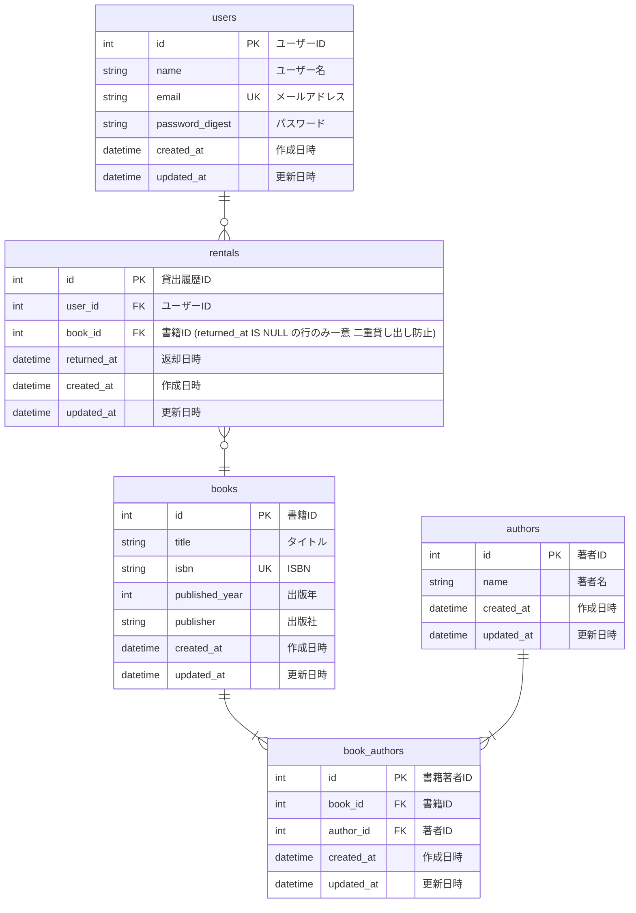
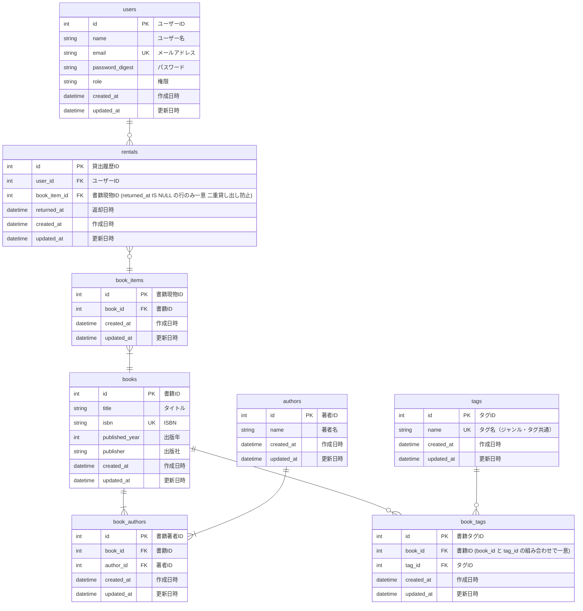
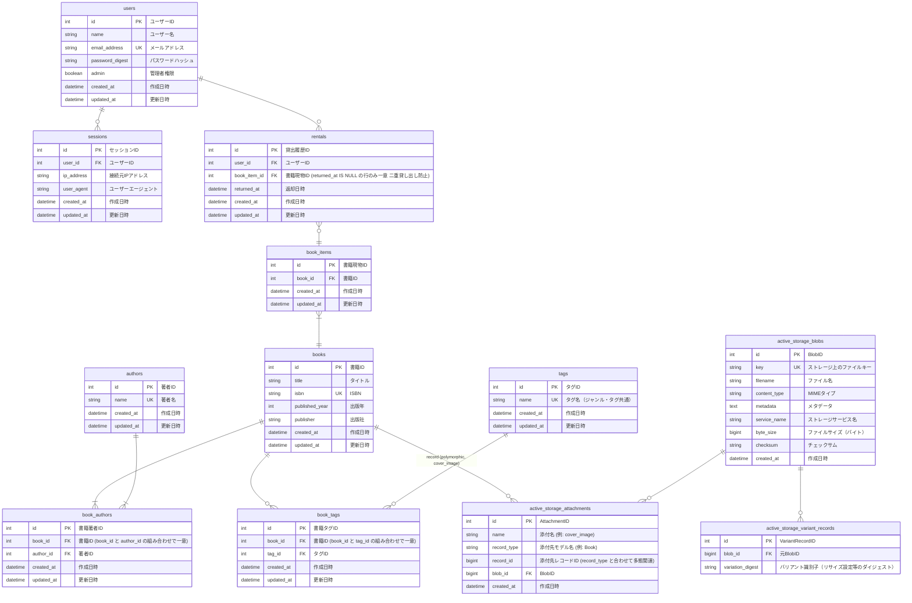

# 必須条件（基礎）

## 発展要件（応用）

## 現在の実装（最終）

`db/schema.rb`（version: 2026_07_07_090000）時点の実際のテーブル構成。認証まわりの命名や `book_items` → `book_copies` へのリネームなど、設計段階からいくつか変更が入っている。Solid Queue / Solid Cable が使う `solid_queue_*` / `solid_cable_messages` テーブルは Rails 標準のジョブ・Action Cable 基盤であり業務ドメインに属さないため、この図では割愛する。

### 設計段階からの主な変更点

| 項目 | 設計時（発展要件） | 実装 | 理由 |
|---|---|---|---|
| ユーザーのメール | `email` | `email_address` | Rails 8 の `bin/rails generate authentication` が生成する標準の認証スキャフォールドがこのカラム名を使うため |
| ユーザーの権限 | `role` (string) | `admin` (boolean) | 権限が「管理者かどうか」の二値のみで、多段階の役割が不要だったため boolean に単純化 |
| 書籍現物 | `book_items` | `book_copies` | 同一書籍の物理的な複製・蔵書1冊を表す語として `copy` の方がドメイン上一意に意味が伝わると考え、`BookCopy` モデル名とも一致させた。OSSの図書館管理システム（ILS）にも先例があり（例: Evergreen ILSの `asset.copy` テーブル）、一定の妥当性はあった。ただし2026-07-21に、開発者の語感として `book_items` の方がしっくりくるという判断で `book_items` に再度リネームされている（詳細は「現在の実装（最新）」参照） |
| セッション管理 | （未定義） | `sessions` テーブルを新規追加 | Rails 8 標準の認証機構が Cookie に署名付きセッションIDのみを保持し、実体（`ip_address` / `user_agent` など）をDBで管理する方式のため。これにより特定端末からのログアウト（セッション無効化）が可能になる |
| 著者名の一意性 | 制約なし | `authors.name` に UNIQUE 制約 | 同姓同名の著者レコードが重複作成されるのを防ぐため（`Author.find_or_create_by!` で名寄せする実装と対応） |

## 現在の実装（最新）

`db/schema.rb`（version: 2026_07_21_060000）時点。上記「現在の実装（最終）」からの差分は、①書影画像機能（ISBN検索時に Google Books API から取得した表紙画像を Active Storage で保存する機能）の追加に伴う `active_storage_*` テーブル群、②`book_copies` → `book_items` への再リネーム（詳細は下記）の2点。

### 「現在の実装（最終）」からの変更点

| 項目 | 内容 | 理由 |
|---|---|---|
| `active_storage_blobs` / `active_storage_attachments` / `active_storage_variant_records` | 新規追加 | ISBN検索時に Google Books API から取得した書影画像を `Book#cover_image`（`has_one_attached`）として保存するため。Active Storage 標準のテーブル構成で、`books` とは `record_type`/`record_id` による多態関連（今回は `Book` のみが対象）。Solid Queue / Solid Cable と同様、Rails 標準基盤のテーブルだが、業務データ（画像）を保持する点が異なるためここでは明示している |
| 書籍現物 | `book_copies` → `book_items` に再リネーム | 一度 `copy` を採用したものの、開発者の語感として発展要件の設計時点の命名（`book_items`）の方がしっくりくると判断し、実装（テーブル名・モデル名 `BookItem`・関連メソッド名・ルーティング）とER図の両方を `book_items` に統一した。`copy` にもOSSの図書館システム（Evergreen ILS の `asset.copy` 等）という先例があり選択として妥当ではあったが、命名は最終的にはチーム・開発者の言語感覚に基づく判断であり、先例の有無だけで一意に「正解」が決まるものではない |
