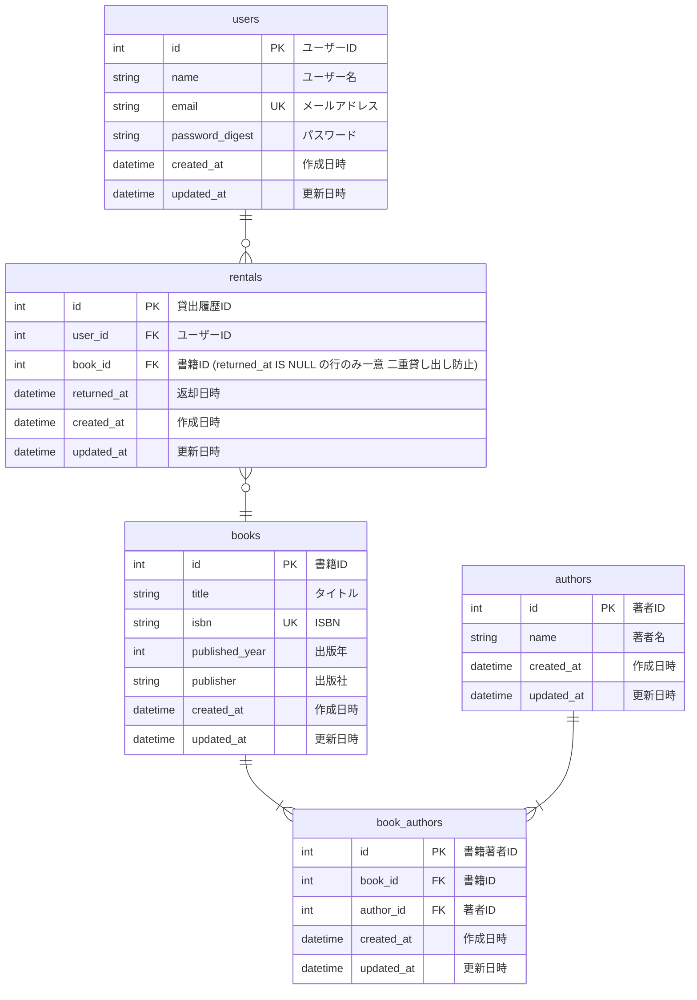
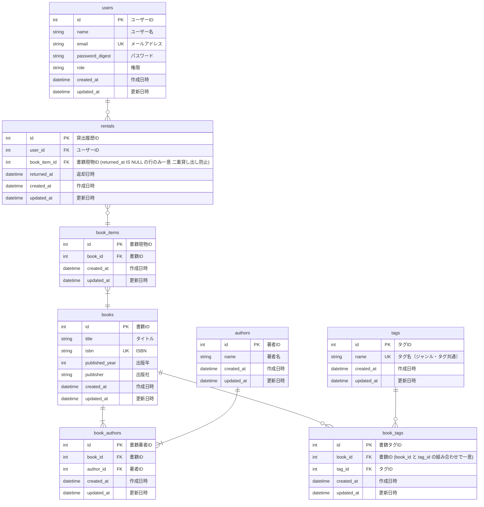
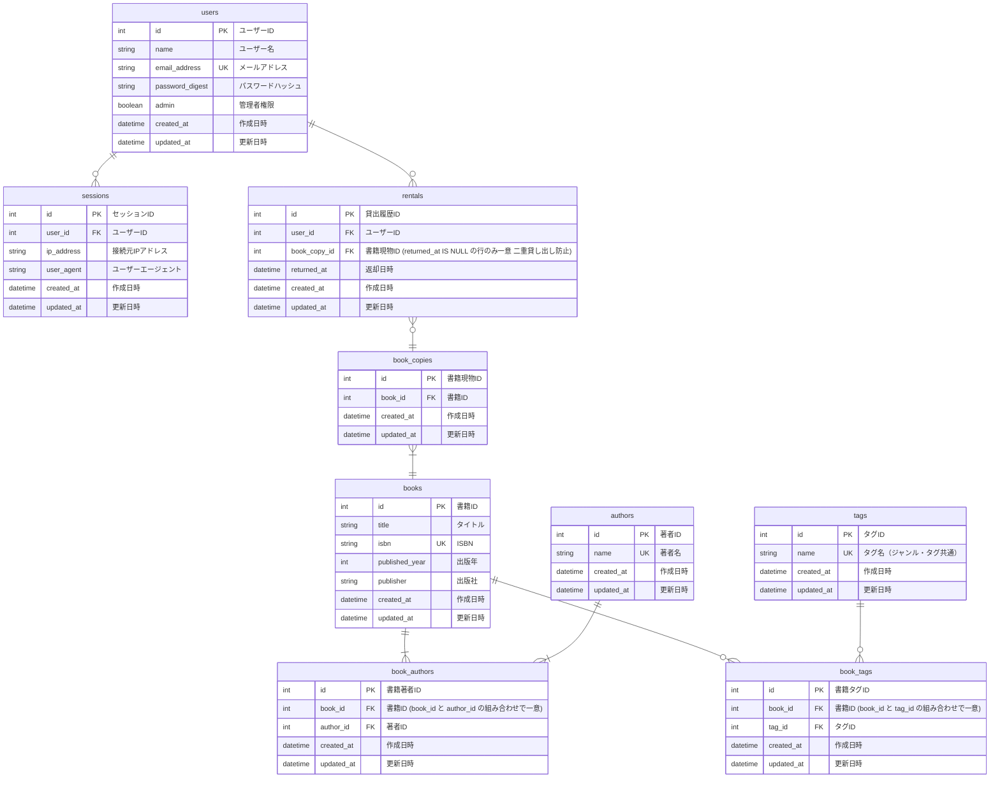

# 必須条件（基礎）

## 発展要件（応用）

## 現在の実装（最終）

`db/schema.rb`（version: 2026_07_07_090000）時点の実際のテーブル構成。認証まわりの命名や `book_items` → `book_copies` へのリネームなど、設計段階からいくつか変更が入っている。Solid Queue / Solid Cable が使う `solid_queue_*` / `solid_cable_messages` テーブルは Rails 標準のジョブ・Action Cable 基盤であり業務ドメインに属さないため、この図では割愛する。

### 設計段階からの主な変更点

| 項目 | 設計時（発展要件） | 実装 | 理由 |
|---|---|---|---|
| ユーザーのメール | `email` | `email_address` | Rails 8 の `bin/rails generate authentication` が生成する標準の認証スキャフォールドがこのカラム名を使うため |
| ユーザーの権限 | `role` (string) | `admin` (boolean) | 権限が「管理者かどうか」の二値のみで、多段階の役割が不要だったため boolean に単純化 |
| 書籍現物 | `book_items` | `book_copies` | 「同じ本の複製・冊」を表す語として `copy`（蔵書の1冊）の方が一般的で、`BookCopy` モデル名とも一致させた |
| セッション管理 | （未定義） | `sessions` テーブルを新規追加 | Rails 8 標準の認証機構が Cookie に署名付きセッションIDのみを保持し、実体（`ip_address` / `user_agent` など）をDBで管理する方式のため。これにより特定端末からのログアウト（セッション無効化）が可能になる |
| 著者名の一意性 | 制約なし | `authors.name` に UNIQUE 制約 | 同姓同名の著者レコードが重複作成されるのを防ぐため（`Author.find_or_create_by!` で名寄せする実装と対応） |
