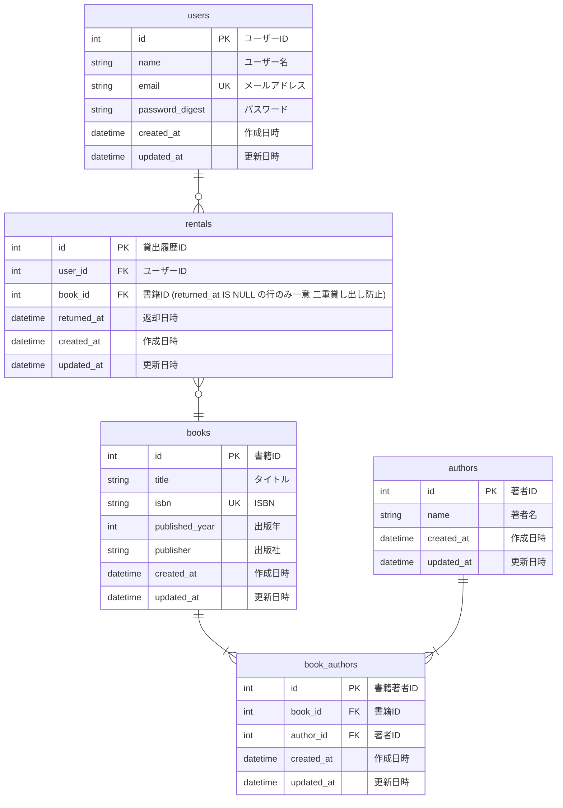
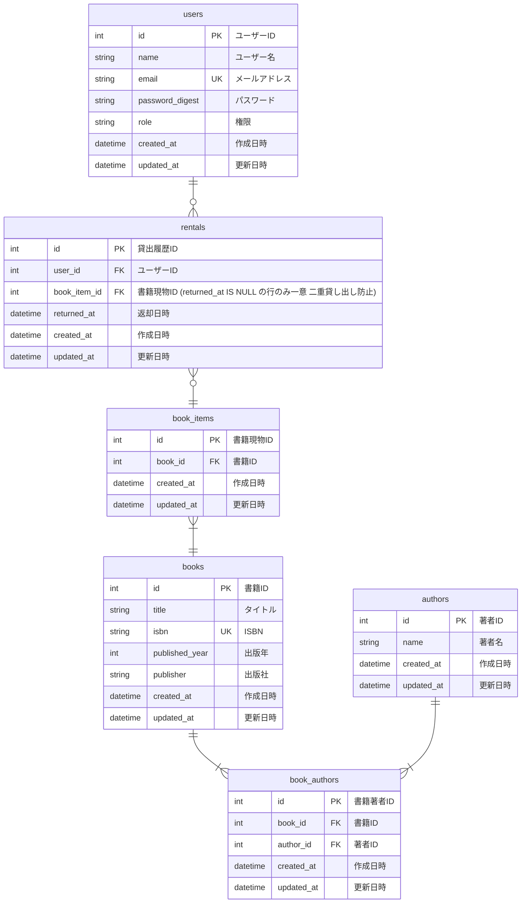

# 必須条件（基礎）

```mermaid
erDiagram
  users {
    int id PK "ユーザーID" 
    string name "ユーザー名"
    string email UK "メールアドレス"
    string password_digest "パスワード"
    datetime created_at "作成日時"
    datetime updated_at "更新日時"
  }
  rentals {
    int id PK "貸出履歴ID"
    int user_id FK "ユーザーID"
    int book_id FK "書籍ID (returned_at IS NULL の行のみ一意 二重貸し出し防止)"
    datetime returned_at  "返却日時"
    datetime created_at "作成日時"
    datetime updated_at "更新日時"
  }
  books {
    int id PK "書籍ID"
    string title "タイトル"
    string isbn UK "ISBN"
    int published_year "出版年"
    string publisher "出版社"
    datetime created_at "作成日時"
    datetime updated_at "更新日時"
  }
  book_authors {
    int id PK "書籍著者ID"
    int book_id FK "書籍ID"
    int author_id FK "著者ID"
    datetime created_at "作成日時"
    datetime updated_at "更新日時"
  }
  authors {
    int id PK "著者ID"
    string name "著者名"
    datetime created_at "作成日時"
    datetime updated_at "更新日時"
  }
  users ||--o{ rentals : ""
  rentals }o--|| books : ""
  books ||--|{ book_authors : ""
  authors ||--|{ book_authors : ""
```

## 発展要件（応用）

```mermaid
erDiagram
  users {
    int id PK "ユーザーID" 
    string name "ユーザー名"
    string email UK "メールアドレス"
    string password_digest "パスワード"
    string role "権限"
    datetime created_at "作成日時"
    datetime updated_at "更新日時"
  }
  rentals {
    int id PK "貸出履歴ID"
    int user_id FK "ユーザーID"
    int book_item_id FK "書籍現物ID (returned_at IS NULL の行のみ一意 二重貸し出し防止)"
    datetime returned_at  "返却日時"
    datetime created_at "作成日時"
    datetime updated_at "更新日時"
  }
  book_items {
    int id PK "書籍現物ID"
    int book_id FK "書籍ID"
    datetime created_at "作成日時"
    datetime updated_at "更新日時"
  }
  books {
    int id PK "書籍ID"
    string title "タイトル"
    string isbn UK "ISBN"
    int published_year "出版年"
    string publisher "出版社"
    datetime created_at "作成日時"
    datetime updated_at "更新日時"
  }
  book_authors {
    int id PK "書籍著者ID"
    int book_id FK "書籍ID"
    int author_id FK "著者ID"
    datetime created_at "作成日時"
    datetime updated_at "更新日時"
  }
  authors {
    int id PK "著者ID"
    string name "著者名"
    datetime created_at "作成日時"
    datetime updated_at "更新日時"
  }
  users ||--o{ rentals : ""
  rentals }o--|| book_items : ""
  book_items }|--|| books : ""
  books ||--|{ book_authors : ""
  authors ||--|{ book_authors : ""
```
