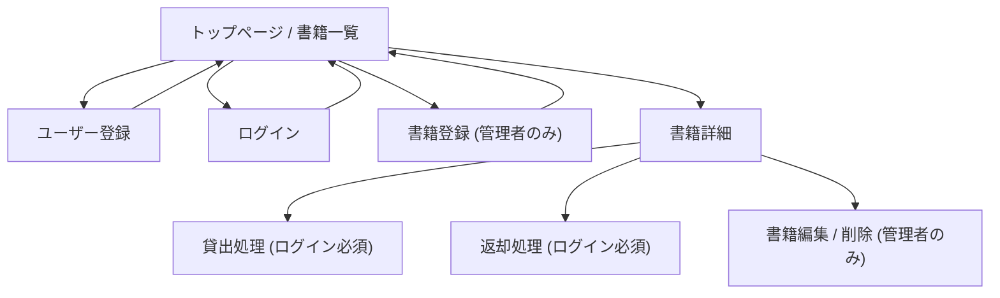

# 卒業課題：図書管理システム 要件定義

## 概要

研修の集大成として、図書管理を行う Web アプリケーションを **Ruby on Rails** を用いて開発する。

社内の書籍を登録し、ユーザーが検索・貸出・返却を行えることを基本とする。
RDBMS の設計を重視し、**1対多と多対多のリレーションを必ず含める**ことを要件とする。

---

## 必須要件（基礎）

### 1. ユーザー認証

- ユーザーは会員登録・ログイン・ログアウトができること（gem ライブラリ利用可）
- 貸出・返却はログイン済みユーザーのみ可能

### 2. 書籍管理

- 書籍の CRUD（登録・閲覧・更新・削除）ができること
- 書籍に登録できる属性：タイトル・ISBN・出版年・出版社・著者

### 3. リレーション構造

| リレーション | 種別 |
|---|---|
| 書籍（多）― 著者（多） | 多対多 |
| ユーザー（1）― 貸出履歴（多） | 1対多 |

### 4. 貸出・返却機能

- ユーザーは書籍を借りられる
- 貸出中の書籍は他ユーザーが借りられない
- 返却ができる

### 5. 書籍一覧・検索

- 書籍の一覧表示
- タイトル・著者名で検索できる

### 6. ER 図作成

- RDBMS のテーブル設計を行い、ER 図を作成して提出すること
- 作成した ER 図と実装内容が一致していること

---

## 発展要件（応用）

以下のうち、いくつかを選んで実装する。

### 1. ユーザー権限

- 管理者ユーザーは本の登録・削除ができる
- 一般ユーザーは貸出・返却のみ可能

### 2. 在庫管理

- 同じ本を複数冊登録できる
- 在庫数を管理し、同時に複数人が借りられるようにする

### 3. タグ・ジャンル管理（多対多）

- 書籍にジャンル（技術書、小説、ビジネスなど）やタグをつけられる
- 書籍（多）― タグ（多）の多対多を実装

### 4. 貸出履歴の閲覧

- 各ユーザーが自分の貸出履歴を閲覧できる
- 管理者は全ユーザーの貸出履歴を参照可能

### 5. UI/UX 改善

- ページネーションやソート機能を導入
- レスポンシブ対応でスマートフォンでも利用可能にする

### 6. 外部 API 連携

- ISBN から Google Books API などを使って書籍情報を自動取得する

---

## 開発条件

| 項目 | 内容 |
|---|---|
| フレームワーク | Ruby on Rails |
| データベース | RDBMS（PostgreSQL） |
| ER 図 | 必ず作成し提出すること（設計レビュー用） |
| 画面設計 | 提出すること |
| ページ遷移図 | 基本的なものを提供する |
| デプロイ | デプロイ可能な環境に公開すること（Heroku / Render / Railway / AWS など） |

---

## 画面遷移図（必須要件範囲）

```
トップページ/書籍一覧
├── ユーザー登録
├── ログイン
├── 書籍登録（管理者のみ）
├── 検索
└── 書籍詳細
    ├── 貸出処理（ログイン必須）
    ├── 返却処理（ログイン必須）
    └── 書籍編集/削除（管理者のみ）
```



---

## 評価観点

- 必須要件を正しく満たしているか
- ER 図を含むリレーション設計の正しさ（1対多・多対多の両方があるか）
- ソースコードの可読性・保守性（命名、ディレクトリ構造、コメント）
- 発展要件への取り組み度合い
- UI/UX やデプロイを含む完成度
