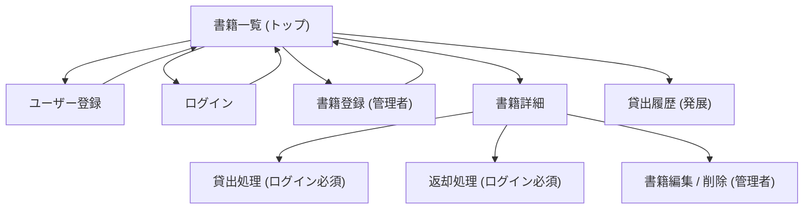

# 卒業課題：図書管理システム 画面設計書

各画面の「表示項目・入力項目・操作（ボタン）・権限/状態による出し分け・使用コンポーネント」を定義する。

* **UI 基盤**: Ruby on Rails (ERB) + Tailwind CSS + [daisyUI](https://daisyui.com/)（見た目）+ [Hotwire](https://hotwired.dev/)（Turbo / Stimulus・動き）

* **見た目の参照（Figma）**: [rails図書管理システム (Drafts)](https://www.figma.com/design/LvZLrrRNitxoOl0gNWxyHT/)

  * 書籍一覧（カード版）= フレーム `書籍一覧 (Book List)`

  * 書籍一覧（テーブル版・採用）= フレーム `トップページ / 書籍一覧`

> 一覧表示は **カード版とテーブル版を比較検討し、図書「管理」用途・データ量・操作性からテーブル版を採用**した。

> **技術選定の補足**: Figma は Flowbite で設計したが、実装では **daisyUI** を採用した。理由＝動きを Hotwire で実装するため Flowbite の JS が不要になり、daisyUI の方が ERB が短く読みやすいため。Figma はクラス一致ではなく **画面構造・要素の参照** として用いる。

***

## 共通仕様

### 共通レイアウト

| 部位           | 内容                                                     |
| ------------ | ------------------------------------------------------ |
| ヘッダー（Navbar） | ロゴ「図書管理システム」/ ナビ（ホーム・書籍一覧・貸出履歴・マイページ）/ 右上にログイン状態に応じた操作 |
| メイン          | 各画面のコンテンツ                                              |
| フッター         |                                                  |

### ヘッダー右上の出し分け

| ログイン状態 | 表示                        |
| ------ | ------------------------- |
| 未ログイン  | `ログイン` `新規登録`             |
| 一般ユーザー | ユーザー名 / `マイページ` / `ログアウト` |
| 管理者    | 上記 ＋ `書籍登録` `管理`          |

### 権限の種類

| 権限         | できること                      |
| ---------- | -------------------------- |
| ゲスト（未ログイン） | 書籍の閲覧・検索のみ                 |
| 一般ユーザー     | ＋ 貸出・返却・自分の貸出履歴閲覧          |
| 管理者        | ＋ 書籍の登録・編集・削除・全ユーザーの貸出履歴閲覧 |

***

## 1. 書籍一覧（トップページ）

| 項目     | 内容                 |
| ------ | ------------------ |
| 目的     | 蔵書の一覧表示・検索の起点      |
| 想定ルート  | `GET /books`（root） |
| アクセス権限 | 全員（ゲスト含む）          |

### 表示項目（テーブル）

| 列    | 内容            | 備考              |
| ---- | ------------- | --------------- |
| タイトル | 書籍タイトル        | クリックで詳細へ        |
| 著者   | 著者名（複数可）      | 多対多             |
| 出版社  | 出版社名          |           |
| 出版年  | 出版年           | ソート対象候補         |
| 状態   | `貸出可` / `貸出中` | BadgeかChip（緑/赤） |
| 操作   | `詳細` ボタン      | 詳細ページへ遷移        |

### 操作

* **検索フォーム**: タイトル・著者名で絞り込み（`GET /books?q=...`）

* **ページネーション**: 一覧下部（発展：ソート）

* 行クリック / `詳細` ボタン → 書籍詳細へ

***

## 2. 書籍詳細

| 項目     | 内容                                 |
| ------ | ---------------------------------- |
| 目的     | 1冊の詳細表示と、貸出・返却・管理操作の起点             |
| 想定ルート  | `GET /books/:id`                   |
| アクセス権限 | 閲覧は全員 / 貸出・返却はログイン必須 / 編集・削除は管理者のみ |

### 表示項目

| 項目               | 内容                                   |
| ---------------- | ------------------------------------ |
| パンくず             | `ホーム > 書籍一覧 > 〈タイトル〉`                |
| 表紙               | 画像（無い場合はプレースホルダ。発展：Google Books API） |
| タイトル             | 大見出し                                 |
| 著者               | 著者名（複数）                              |
| 状態               | `貸出可` / `貸出中` Badge                  |
| ISBN / 出版社 / 出版年 | 詳細情報リスト                              |
| ジャンル・タグ          | （発展）Badge 複数                         |

### 操作（ボタンの出し分け）★この画面の核心

| 状態                    | 表示されるボタン                          |
| --------------------- | --------------------------------- |
| 未ログイン                 | `ログインして借りる`（ログインへ誘導）              |
| ログイン済み・貸出可            | `借りる`（Brand）                      |
| ログイン済み・貸出中（借りているのが本人） | `返却する`（Warning）                   |
| ログイン済み・貸出中（他人が貸出中）    | ボタン無効（`貸出中`表示のみ）                  |
| 管理者                   | 上記に加え `編集`（Secondary）`削除`（Danger） |

***

## 3. ログイン

| 項目     | 内容                           |
| ------ | ---------------------------- |
| 目的     | 既存ユーザーの認証                    |
| 想定ルート  | `GET /login` → `POST /login` |
| アクセス権限 | 未ログインユーザー                    |

### 入力項目

| 項目      | 種類       | 必須 | バリデーション |
| ------- | -------- | -- | ------- |
| メールアドレス | email    | ◯  | 形式チェック  |
| パスワード   | password | ◯  | —       |

### 操作

* `ログイン` ボタン → 認証成功で書籍一覧へ

* `新規登録はこちら` リンク → ユーザー登録へ

***

## 4. ユーザー登録

| 項目     | 内容                            |
| ------ | ----------------------------- |
| 目的     | 新規会員登録                        |
| 想定ルート  | `GET /signup` → `POST /users` |
| アクセス権限 | 未ログインユーザー                     |

### 入力項目

| 項目        | 種類       | 必須 | バリデーション |
| --------- | -------- | -- | ------- |
| 名前        | text     | ◯  | —       |
| メールアドレス   | email    | ◯  | 形式・一意   |
| パスワード     | password | ◯  | 最小文字数   |
| パスワード（確認） | password | ◯  | 一致確認    |

### 操作

* `登録する` ボタン → 成功でログイン状態にして書籍一覧へ

* `ログインはこちら` リンク

***

## 5. 書籍登録（管理者のみ）

| 項目     | 内容                               |
| ------ | -------------------------------- |
| 目的     | 新しい書籍の登録                         |
| 想定ルート  | `GET /books/new` → `POST /books` |
| アクセス権限 | **管理者のみ**（一般ユーザーはアクセス不可）         |

### 入力項目

| 項目      | 種類            | 必須 | 備考                 |
| ------- | ------------- | -- | ------------------ |
| タイトル    | text          | ◯  |              |
| ISBN    | text          | ◯  | 形式チェック（発展：API自動取得） |
| 出版年     | number / date | ◯  |              |
| 出版社     | text          | ◯  |              |
| 著者      | 複数選択 / 追加入力   | ◯  | 多対多（既存著者選択＋新規追加）   |
| ジャンル・タグ | 複数選択          | △  | （発展）多対多            |
| 在庫数     | number        | △  | （発展）在庫管理           |

### 操作

* `登録する` ボタン → 成功で詳細 or 一覧へ

* `キャンセル` → 一覧へ

***

## 6. 書籍編集 / 削除（管理者のみ）

| 項目     | 内容                                                                     |
| ------ | ---------------------------------------------------------------------- |
| 目的     | 既存書籍の更新・削除                                                             |
| 想定ルート  | 編集 `GET /books/:id/edit` → `PATCH /books/:id` ／ 削除 `DELETE /books/:id` |
| アクセス権限 | **管理者のみ**                                                              |

### 入力項目

書籍登録と同一（既存値がプリフィル済み）

### 操作

* `更新する` ボタン → 詳細へ

* `削除する`（Danger）→ 確認モーダル（Modal）→ 削除して一覧へ

* `キャンセル`

***

## 7. 貸出履歴（発展要件）

| 項目     | 内容                             |
| ------ | ------------------------------ |
| 目的     | 貸出・返却の履歴閲覧                     |
| 想定ルート  | `GET /rentals`（自分の履歴）/ 管理者は全件  |
| アクセス権限 | ログインユーザー（一般＝自分のみ / 管理者＝全ユーザー分） |

### 表示項目（テーブル）

| 列          | 内容                  |
| ---------- | ------------------- |
| 書籍タイトル     | 貸出した書籍              |
| 貸出日        | 借りた日                |
| 返却日        | 返した日（未返却は空）         |
| 状態         | `貸出中` / `返却済` Badge |
| （管理者のみ）利用者 | 借りたユーザー名            |

***

## 画面遷移（再掲）

***

## 状態・権限の出し分け一覧

| 画面         | ゲスト   | 一般ユーザー   | 管理者      |
| ---------- | ----- | -------- | -------- |
| 書籍一覧       | 閲覧・検索 |    | ＋ 書籍登録導線 |
| 書籍詳細       | 閲覧のみ  | ＋ 借りる/返す | ＋ 編集/削除  |
| 書籍登録・編集・削除 | ✕     | ✕        | ◯        |
| 貸出履歴       | ✕     | 自分のみ     | 全員分      |
